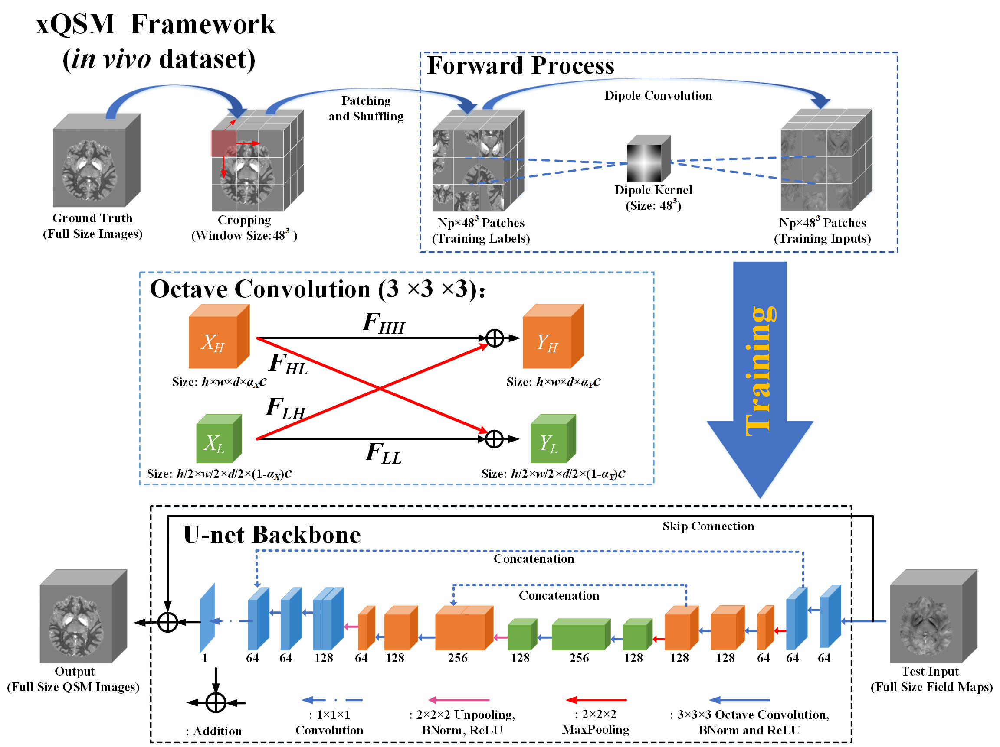

# xQSM – Quantitative Susceptibility Mapping with Octave Convolutional Neural Networks

For a quick demo for testing, download the repository, navigate MATLAB to the 'eval' folder and run the script 'run_demo.m'
This demo compares four different neural networks for QSM dipole inversion.
A COSMOS map is used as the groud truth/label for quantitative assessment.

